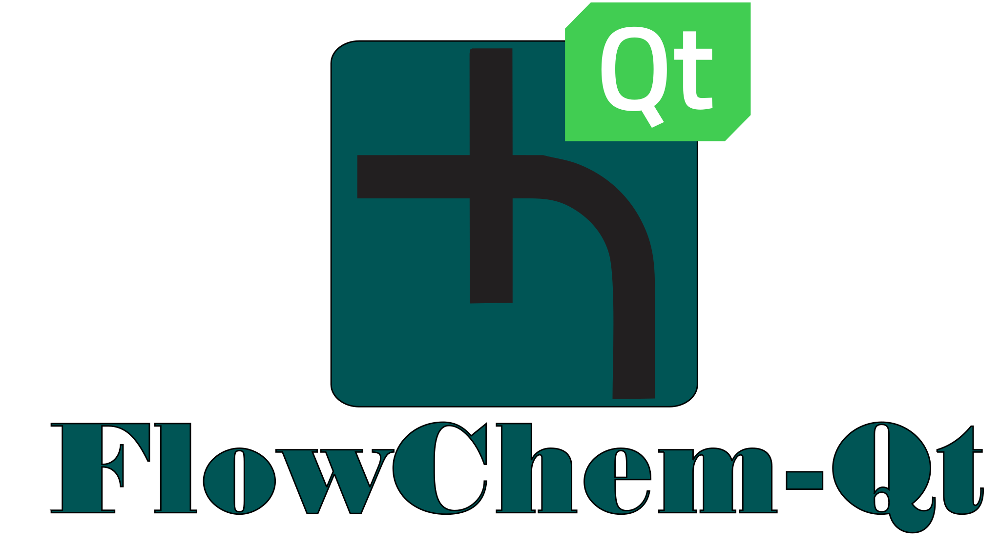
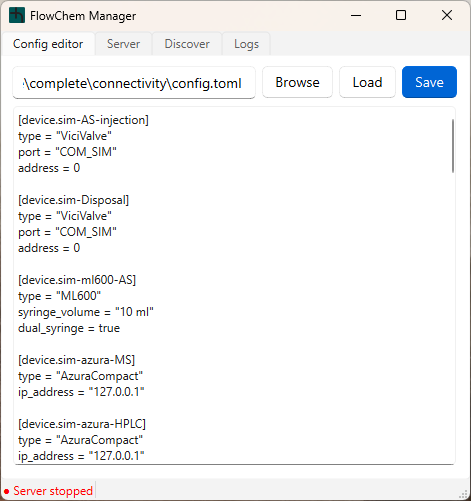
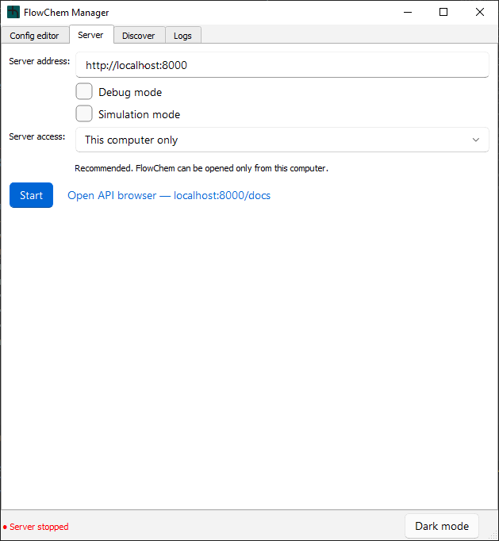
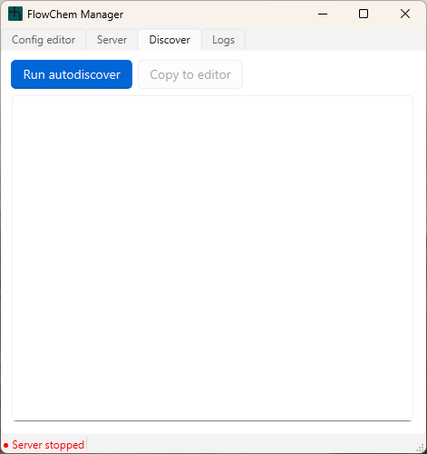

<p align="center">
  
</p>

<p align="center">
  A desktop application to manage the <a href="https://github.com/automatedchemistry/flowchem">FlowChem</a> server — configure devices, control the server process, and auto-discover hardware, all from one window.
</p>

---

## Requirements

- Python ≥ 3.11
- GUI runtime: PyQt5 and PyQt-Fluent-Widgets
- FlowChem installed and available on `PATH` (activate your FlowChem virtualenv before launching)

## Installation

```bash
pip install flowchem-qt
```

Or, to install from source:

```bash
pip install -e .
```

For development, use a fresh virtual environment when switching Qt bindings. The QFluentWidgets PyQt5, PyQt6, PySide2, and PySide6 packages all provide the same `qfluentwidgets` import package, so they should not be installed together.

PyQt5 and PyQt-Fluent-Widgets are GPL/commercial-license runtime dependencies. The FlowChem Qt application license is unchanged, but downstream distribution should account for those dependency licenses.

## Usage

```bash
flowchem-qt              # launches silently with tray (no console window on Windows)
flowchem-qt --no-tray    # launches silently without tray; closing the window exits
python main.py           # development / debug
```

### Windows virtualenv launcher

To create a double-clickable launcher that uses the project's `.venv`, run:

```powershell
python scripts/build_bat.py
```

This writes `flowchem-qt.bat` in the project root. Double-click it to start the
application without leaving a command window open. A `cmd.exe` window may flash
briefly while the launcher starts `pythonw.exe`.

The launcher prepends `.venv\Scripts` to `PATH`, allowing the GUI to find
`flowchem`, `flowchem-sim`, and `flowchem-autodiscover`. To use a different
virtual environment, regenerate it with:

```powershell
python scripts/build_bat.py --venv-dir path\to\venv
```

Relative virtual-environment paths are resolved from the project root. Regenerate
the launcher whenever the virtual environment is moved or replaced.

On Windows, the **Create shortcut** button beside the theme button provides the
same setup from the GUI. Choose a destination folder and the application rebuilds
`flowchem-qt.bat` using the Python environment currently running the GUI, then
creates `FlowChem Qt.lnk` with the FlowChem icon. Recreate the shortcut if the
project or an external Python environment is moved.

---

## Window Overview

The main window has four tabs and a persistent status bar at the bottom showing a coloured dot:

- **Red dot** — server is stopped
- **Green dot** — server is running
- **Dark mode / Light mode** — switches the theme and remembers the selection

### Config editor

Edit the FlowChem `config.toml` directly in the app. Browse for a file, load it into the editor, make changes, and save — no external editor needed. This tab is disabled while the server is running.

<p align="center">
  
</p>

| Element | Description |
|---|---|
| Path field | Full path to the config file. Remembered between sessions. |
| Browse | Opens a file dialog to pick a `.toml` file. |
| Load | Reads the selected file into the editor. |
| Save | Writes the editor content back to disk. |
| Editor area | Plain-text editor for the raw TOML content. The FlowChem server validates on startup. |

---

### Server

Start and stop the FlowChem server and open the interactive API browser.

<p align="center">
  
</p>

| Element | Description |
|---|---|
| Server address | Base URL of the running server (default `http://localhost:8000`). |
| Server access | Controls who can connect to the server. `This computer only` binds to `127.0.0.1`; `Local network` binds to `0.0.0.0` so other computers on the same trusted network can connect. |
| Debug mode | Passes `--debug` to FlowChem for verbose log output. |
| Simulation mode | Launches `flowchem-sim` instead of `flowchem`. All device drivers are replaced with simulated counterparts — no physical hardware required. |
| Start / Stop | Single toggle button. Starts or stops the server process. |
| Open API browser | Opens `<server address>/docs` in the system browser. |

> The address field, server access selector, debug checkbox, and simulation mode checkbox are disabled while the server is running.

---

### Discover

Run `flowchem-autodiscover` to detect connected devices and generate a starter config.

<p align="center">
  
</p>

| Element | Description |
|---|---|
| Run autodiscover | Shows a safety warning, then runs `flowchem-autodiscover`. Output streams in real time. |
| Output area | Read-only display of autodiscover stdout and stderr. |
| Copy to editor | Copies the output into the Config editor for review and saving. |

> **Warning:** autodiscovery communicates over serial ports and may place unsupported devices in an unsafe state. A confirmation dialog is shown before running.
>
> This tab is disabled while the server is running.

---

### Logs

Live log viewer — always accessible, even while the server is running.

| Element | Description |
|---|---|
| Log area | Streams output from the FlowChem server process and internal GUI events. Auto-scrolls to the latest entry. |
| Clear | Clears the log area. |

---

## System tray

By default, closing the main window minimises to the system tray — the application keeps running in the background. Launch with `flowchem-qt --no-tray` to disable the tray and make closing the window exit the application.

FlowChem Manager allows one running instance per operating-system user.
Launching it again from the shortcut, BAT, or command line restores and focuses
the existing window; options passed to the second launch are ignored.

Right-click the tray icon to access:

| Menu item | Description |
|---|---|
| Show window | Brings the main window back to the foreground. |
| Start server | Starts the FlowChem server (uses the config path set in the Config editor). |
| Stop server | Stops the running server. |
| Quit | Fully exits the application. |
